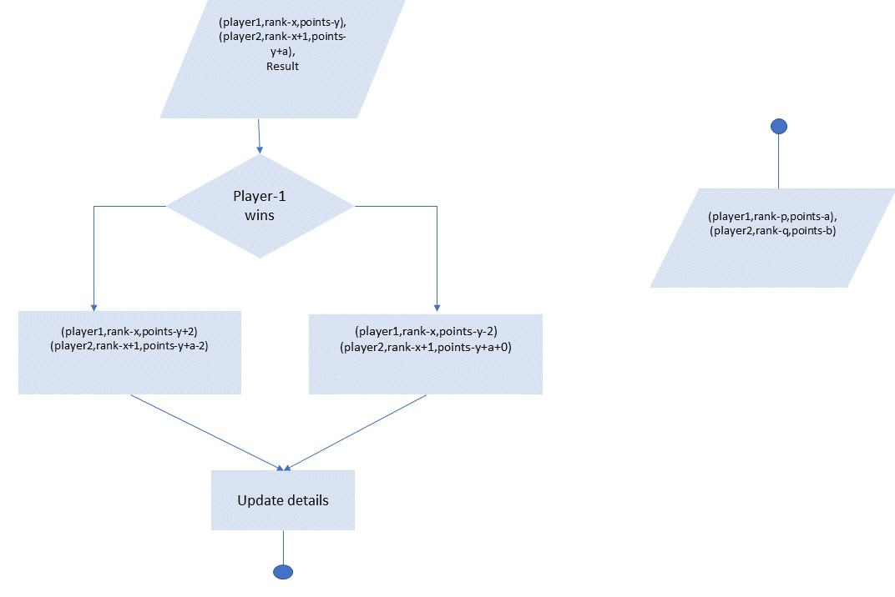
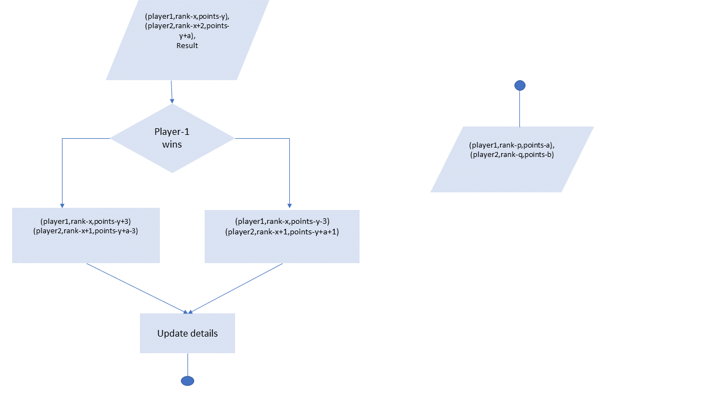

## Following is a list of conditions/ algorithm that was used while the developing the project to update the ranking table.

### Condition-1:
Every player who plays at least one match will get a point for participation.

### Condition-2: 
Fixtures are as follows, let a player be of rank x. Then the player will play a match

with players of rank x+1 and x-1 respectively. Special matches can be held if a player of rank x

wishes to challenge a player of rank x+2
 

 
### Condition-3: 
Suppose rank x plays against rank x+1. And rank x wins, then rank x gets +2 points

whereas, rank x+1 gets a -2 point deduction. Else if rank x+1 wins, rank x+1 does not get any

points, but rank x gets -2 points deduction.
 

 

### Condition-4:
Suppose rank x challenges a player of rank x+2, if rank x wins the player will get +3

points, and rank x+2 player will lose 3 points. Else if x+2 rank player wins then the player gets

+1 point and rank x player loses 3 points.

### Condition-5: 
Maintenance point, if a player preserves its rank for that week then the player will  

get a +1 bonus point. For a player of rank 1, the player will get +3 points for maintaining the
lead.

### Condition:-6:
If a player is absent for consecutive 3 weeks, then the player will be removed.

### Condition:-7: 
If a new player wishes to join. The player has to play three random matches, and
the rank will be assigned as per the points earned.

