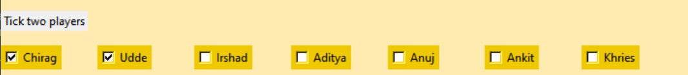
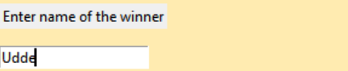
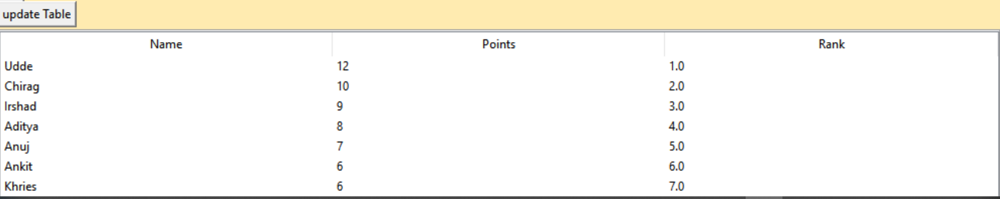

# An example to use the given program is shown below
To run the program successfully, place the Table_points.csv and the ranking.py code in the same folder.
The following steps is a demo of the program.

## 1) Raw Table:
This Table contains the details of the player such as name, points and ranking.
 

 

### 2) Choose players:
This field allows you to tick two players that have played. 
 

 

### 3) Enter Winner:
In this field the name of the winner has to entered, after which press the ok button.
 

 

### 4) Updated:
Now click on the update table button and see the table getting updated.
 

 
