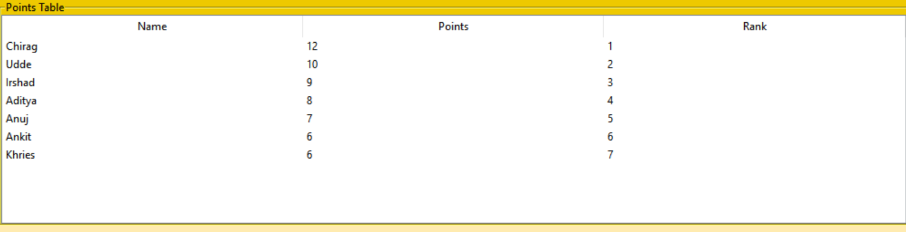

# An example to use the given program is shown below

## 1) Raw Table:
This Table contains the details of the player such as name, points and ranking.
 

 

### 2) Choose players:
This field allows you to tick two players that have played. 
 

 

### 3) Enter Winner:
In this field the name of the winner has to entered, after which press the ok button.
 

 

### 4) Updated:
Now click on the update table button and see the table getting updated.
 

 